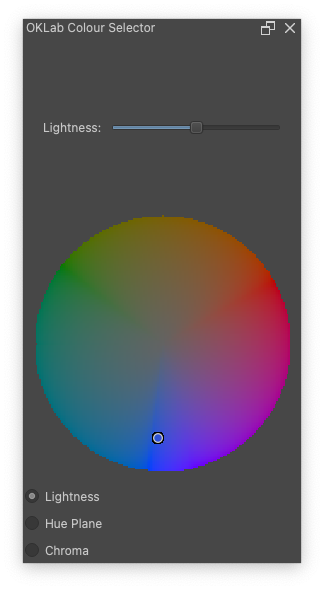
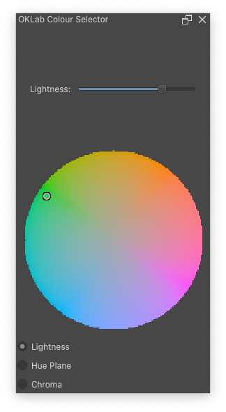
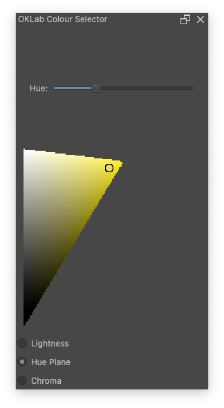
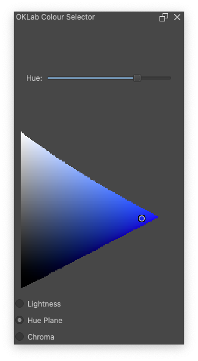
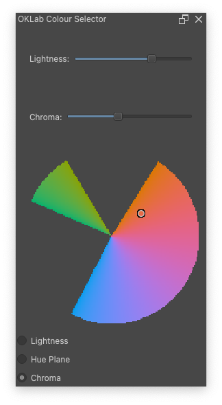
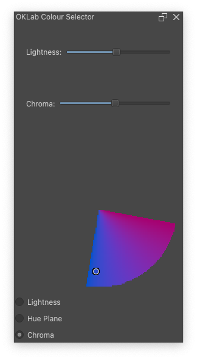

#+options: ':true toc:nil num:nil

#+title: Perceptual Colour Selector
#+subtitle: Based on OKLab/OKCLh

This plug-in is a work in progress. Feel free to give it a try and let
me know what you think but please bear in mind that it is neither
complete nor fully optimised.

The OKLab/OKCLh colour space was introduced in 2020 by Björn Ottosson
in this blog post:
https://bottosson.github.io/posts/oklab/

** Installing
1. Click the '<> Code' drop-down near the top of the github repository
   page and select 'Download ZIP'
2. In the Krita Tools menu, selected Scripts > Import Python Plugin
   from File...
3. Select the downloaded zip file and select 'Yes' when prompted to
   enable the plugin.
4. Restart Krita.

*** Views
There are three views for selecting colours available via the radio
buttons at the bottom.

- Lightness Selector ::
  Displays a 'slice' of the gamut for a given lightness level
  controlled via slider.

  This view distorts the visible OKLCh gamut. Basically, the most
  saturated version of each hue---relative to the current lightness
  level---is always on the edge of the circle even if it's actual
  chroma value would place it further in which results in some hues
  being more stretched out and other more compressed at a given
  lightness.

  #+html: 

  
  
  #+html: 

  
- Hue Plane Selector ::
  Displays a slice of the gamut containing a single hue with lightness
  increasing as you move up and chroma increasing as you move right.

  This view resembles the common triangular colour selector but with
  each triangle skewed to account for the difference in perceptual
  brightness of the hue at its most vivid intensity.

  #+html: 

  
  
  #+html: 

- Chroma/Lightness Selector ::
  Similar to the LightnessSelector but rather than chroma increasing
  as you move away from the center, the entire surface has uniform
  chroma. Both lightness and chroma are controlled with sliders and
  out of gamut colours simply become gaps in the circle.

  #+html: 

  
  
  #+html: 

*** Issues
- Currently all font/window/etc. sizes are hard coded and non-resizable.
- Switching to a new view /should/ update it to the current foreground
  colour. But there seem to be some bugs/edge cases which means it
  doesn't always work properly.
- In the Hue Plane view the hue slider is just a normal slider and
  doesn't display the hues.
- Views and sliders are not as responsive as they should be. This is
  largely because it's the first time I've used Qt/PyQt and I just did
  the simplest thing I could make work. Once I find better ways to do
  things performance should improve.
- Jagged pixelated edges. Pretty much the same issue as above. The
  selector views are smallish images that can be updated relatively
  quickly which are then scaled up slightly. Again, digging further
  into the guts of Qt should eventually fix this problem.
